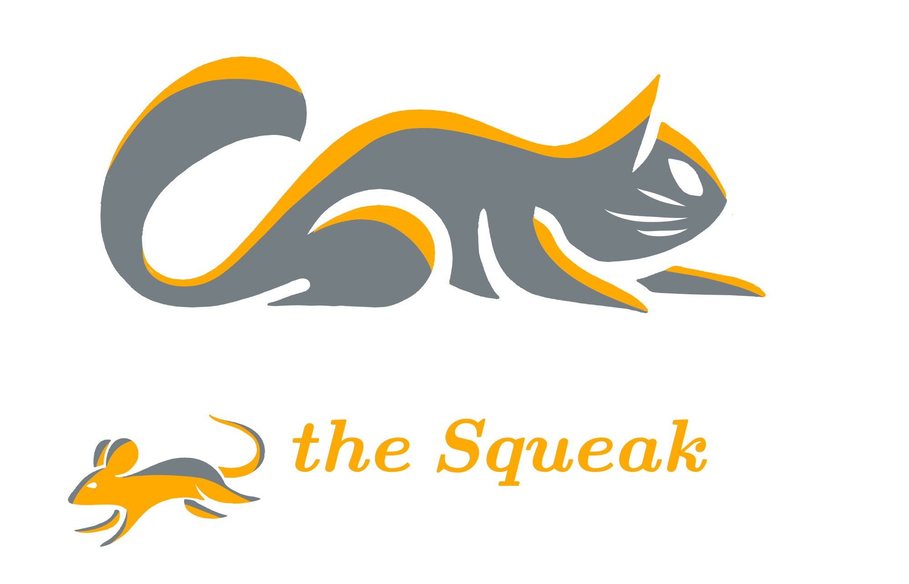
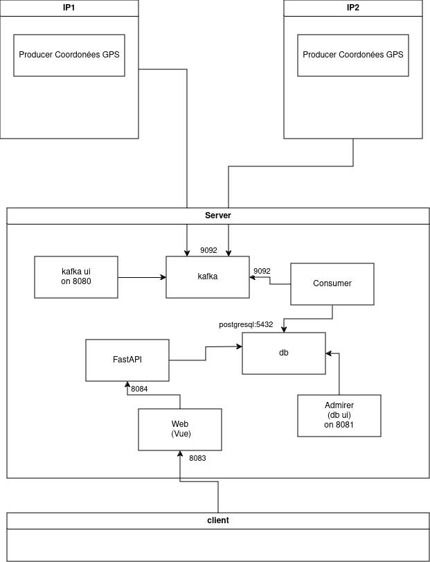

# Gotta Pursue the Squeak
Clementine Galloy, Noe Faucher & Mael Triquet




Gotta Pursue the Squeak est un projet qui permet de traquer les souris 🐁 de Pougne-Hérisson pour aider nos amis les chats 🐱.

## Architecture




## UI for server

### Database 
Atention ! Un volume `../postgres` (relative à la racine du projet) est créé.

UI visible on `localhost:8081`.

serveur: `postgresql:5432`
utilisateur: `user`
mot de passe: `pass`
db: `gps_db`

### Kafka 
UI visible on `localhost:8080`.

kafka on port 9092,9093 

### api
On `localhost:8084`

### Front
On `localhost:8083`


### Lancement

```sh
    docker compose -f docker-compose-server.yml up

    docker compose -f docker-compose-producer.yml up
```


Pour relancer le front,l'api, le consumer ou le producer après modification:
```sh
docker compose -f docker-compose-server.yml down # ou docker-compose-producer.yml
docker image rm front:latest # ou api:latest ou ...
```
